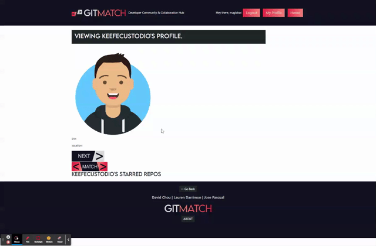

# GIT MATCH
## David Chou, Lauren Darrimon & Jose Pascual

    
    
### Description
Full Stack MERN social network application for developers to find collaboration and community, using React.js, Apollo GraphQL, MongoDB, and GitHub API.

### Table of Contents

* [Link](#link)
* [Installation](#installation)
* [Usage](#usage)
* [Contributing](#contributing)
* [Questions](#questions)
* [License](#license)

### Link 
🔗 
Link to application [git-match](https://morning-sea-85016.herokuapp.com/)

### Installation
🔧
In order to clone and run this application yourself, you need to install the following (dependencies): 

"@apollo/client"

@apollo/react-components"

"@formspree/react"

"aos"

"axios"

"bootstrap"

"graphql"

"jwt-decode"

"react"

"react-bootstrap"

"react-dom"

"react-router-dom"

"react-scripts"

After you have cloned the repo, install all of these dependencies by running: 

~~~
 
npm install 

~~~

### Usage 
To run the application from, from the root folder run 

~~~
npm run develop
~~~

And the client side and serveer side srcipts will run, and the application will open in your borwser. 

### Features

#### Instant Profile & Portfolio
When users sign up on GitMatch, if they use their unique GitHUb user name, the site makes a request to various Git Hub API endpooints to populate an profile from their user data and a portfolio from thier starred repos. 

#### Match to Collaborate
Users can match with other users that they would like to collaborate with, of both usres match, contact info is shared. 

### Contributing 
✍️ 
David Chou, Lauren Duker & Jose Pascual are the author's of this application. 
Find additional work here: 

Lauren Duker's  [Github profile.](http://github.com/laurenDarrimon).
David Chou's  [Github profile.](https://github.com/DazedChou).
& Jose Pascual's [Github profile.](https://github.com/plotinusspascual).

Follow these guildines for contributing to this project: 

### Questions
❓💌
Reach out to David Chou, Lauren Darrimon & Jose Pascual at hello@laurenlalita.com if you have any questions. 

### License
The license for this project is: [MIT](https://opensource.org/licenses/MIT)

